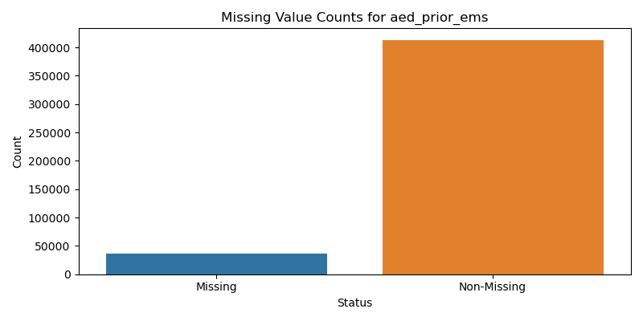
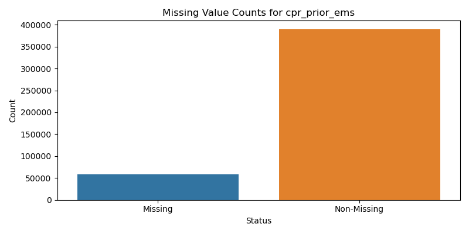
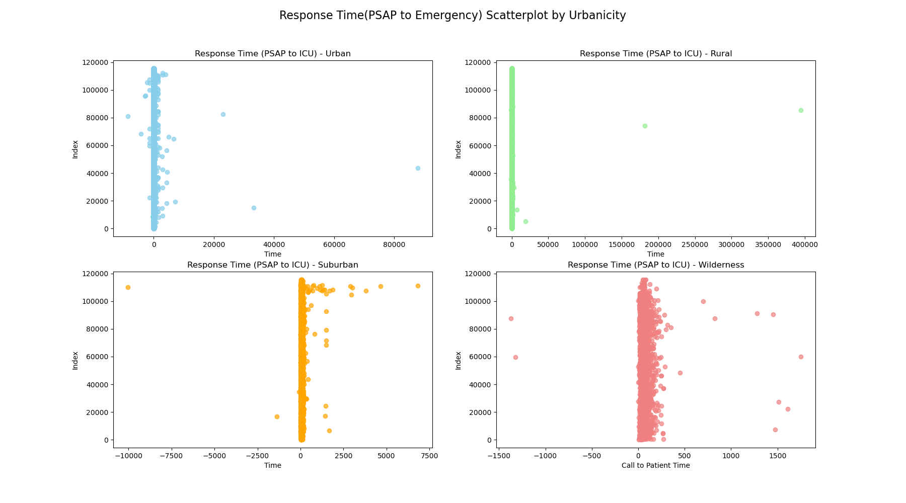
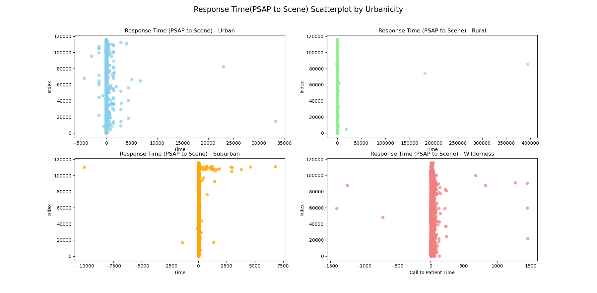
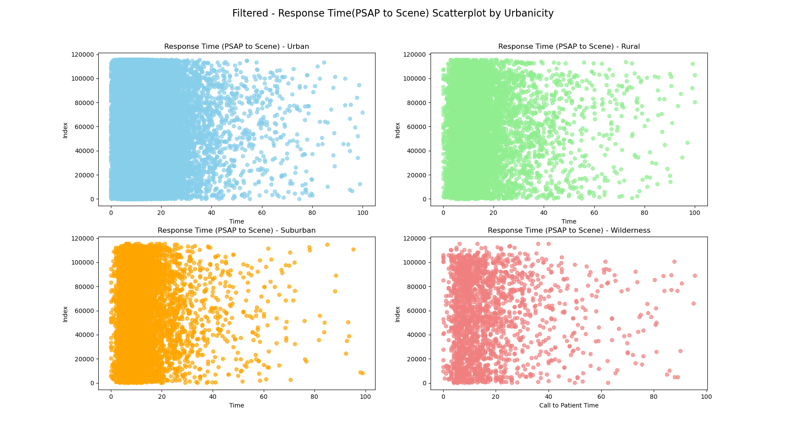
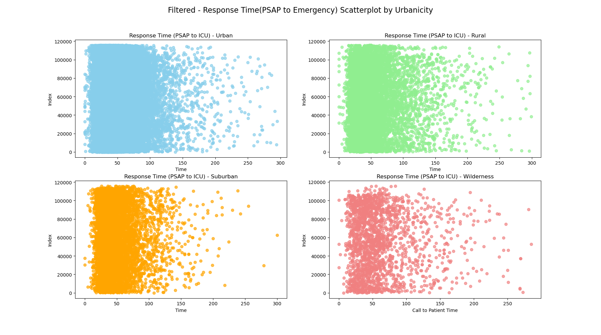
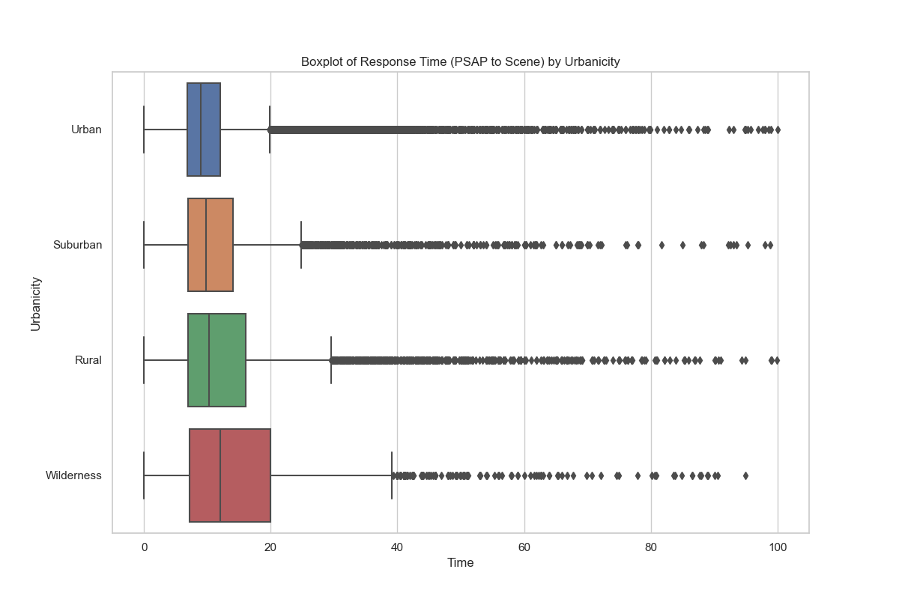
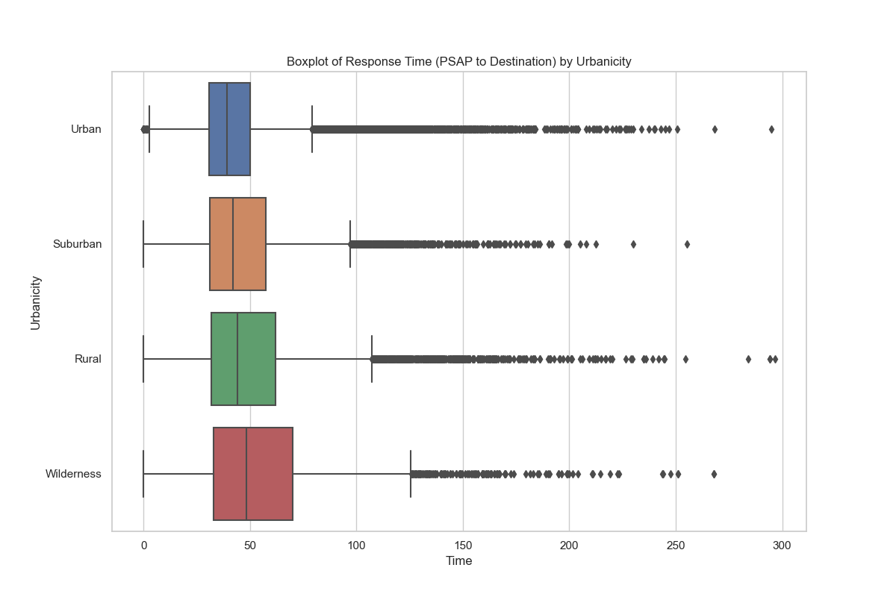
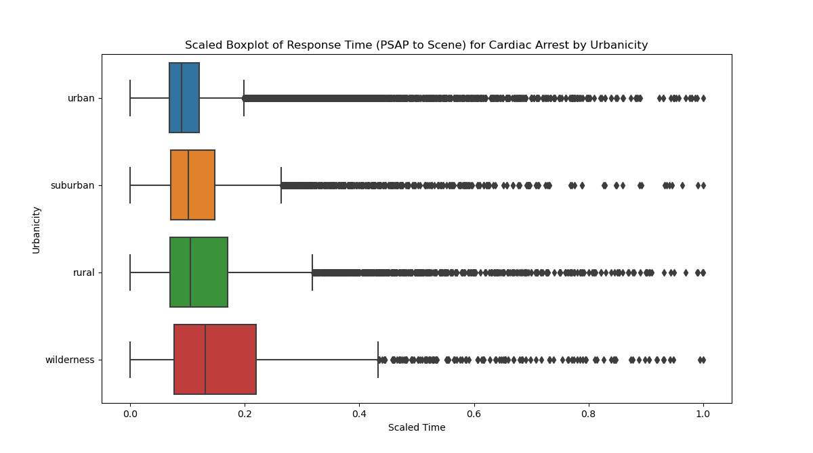
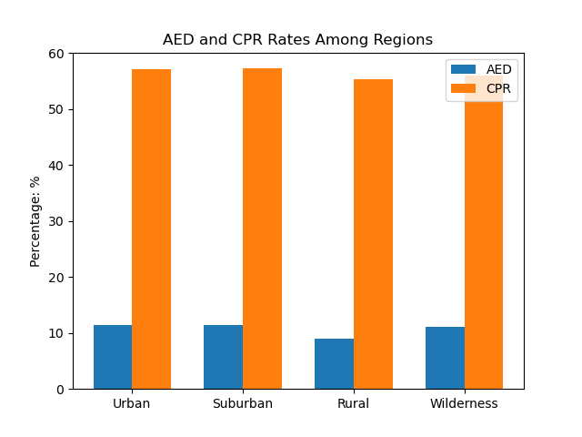

# Background

The objective of this project is to investigate the disparities in emergency care for cardiac arrest victims between rural and urban settings. 

CPR (Cardiopulmonary Resuscitation) and AED (Automated External Defibrillator) should be applied immediately when cardiac arrest (CA) occurs, typically recommended within 4 minutes, as emergency medical services (EMS) often cannot arrive within this time frame (as confirmed by the following exploratory data analysis). Therefore, timely application of CPR and AED before the arrival of an ambulance is crucial. For cardiac arrests caused by conditions such as coronary heart disease or myocardial infarction, it is generally recommended to initiate thrombolysis or surgical intervention within 2 hours. EMS response time, including the time from Public Safety Answering Point (PSAP) receipt of the emergency call to paramedics arriving at the scene, as well as the time from PSAP receipt of the emergency call to the patient's arrival at the hospital, is also of significant importance as a metric.

Given this, we specifically examined the usage of AED and CPR, as well as the response time of emergency services and the time it takes for patients to reach the hospital emergency department, with a focus on distinguishing and comparing the differences in emergency medical services between urban and rural areas.


# Initial EDA

### Make commands

```makefile
make preprocess imputation resopnse-time AEDPCR
```
### About the data source

Access to raw data can be obtained by requesting it from the relevant stakeholders. Once acquired, unzip and transfer the processeddataCA folder into the local data directory. Among all files, "Pub_PCRevents_CA.csv" is the core file in the dataset, and we process the dataset, including eResponse and eArrest, according to the data dictionary of NEMSIS. 

Specifically, we export the data into an SQLite3 database file, and we clean the data by removing entries with missing values labeled as "not applicable," "not recorded," or "unknown." as well.  Additionally, this process includes the imputation of features necessary for modeling. Following this data cleaning phase, the resulting file, imputed-data.csv, is ready for data analysis.

### Missing data 

It is noted that there is some data missing in certain areas. We performed mean imputation for response time and removed rows with missing values for the use of AED and CPR.





### Response time for CA by urbanicity

The time elapsed from the reception of emergency signals by the PSAP to the arrival of rescue personnel at the scene is being statistically analyzed. It has been observed that there are some unreasonable values (negative or extremely large values). To address this issue, data filtering is being conducted, with a focus on selecting values within the range of 0 to 100 minutes. The data for the duration from PSAP to the arrival of the hospital follows the same data filtering as well, except that the range is from 0 to 300 minutes.





After filtering the data, we have:





Drawing two box plots, we observe that the closer to the urban area, the shorter the window period for patients to receive medical treatment. This is more favorable for patients with CA in urban areas.





Scaling response times to a range of 0-1 helps eliminate differences in scales between different regions, ensuring that response times from all areas have similar scales. 



When building a predictive model for mortality rates in the future, we might consider standardizing or scaling the scales of other features such as age and ambulance response time to ensure the model performs well across different scales of features. However, this seems unnecessary at present.




The usage rates of AED and CPR before EMS arrival show little difference between urban and rural areas.

### Outcomes

​	If we can successfully identify the most critical factors affecting the outcomes for cardiac arrest patients, including aspects such as response time, intervention methods, or availability of resources, especially the use of epinephrine, it provides significant meaning toward targeted interventions, which leads to improved survival rates and outcomes for cardiac arrest patients in various settings.

​	However, we encounter problems related to the validity of the NEMSIS dataset, especially if the data on epinephrine use and other factors do not accurately reflect real-world practices, compromising the reliability of our findings. In addition, due to the complexity of factors influencing outcomes, we fail to find significant correlations or causations that could inform actionable changes in rescue efforts or policy.

