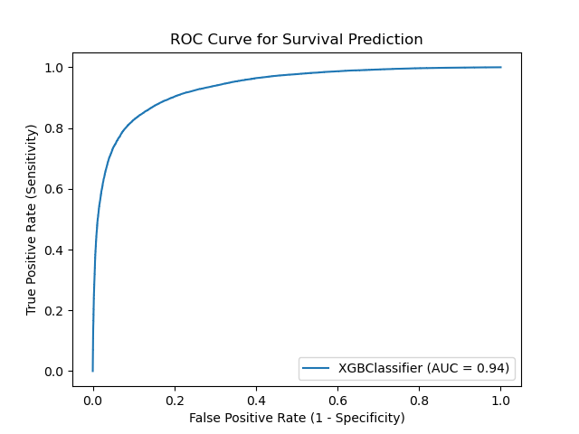
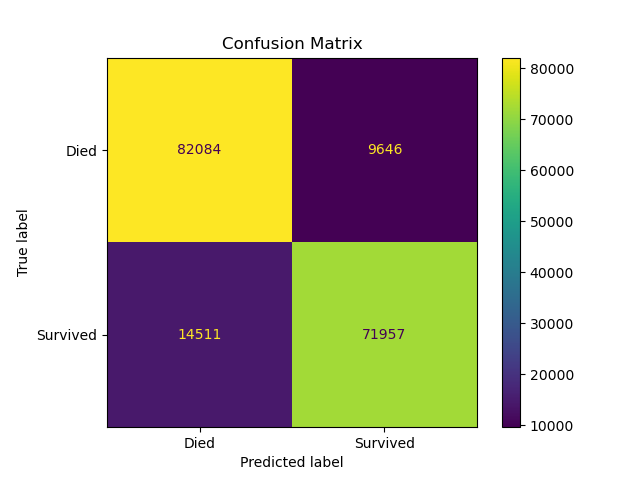

###    Attributions
- Instructor: Professor Bogden
- Stakeholder: Dr. Qingchu Jin

### Analytic objectives
The primary objective of this study is to leverage the predictive power of the XGBoost algorithm to evaluate the effectiveness of emergency interventions in Out-of-Hospital Cardiac Arrest (OHCA) cases. Utilizing a comprehensive set of clinical and contextual features, the study aims to identify key predictors of survival outcomes. Additionally, we seek to enhance the accuracy of predictions by excluding data with excessive response times, advanced age, and logical inconsistencies, thereby focusing on generating actionable insights that could potentially improve emergency response strategies and patient survival rates in OHCA scenarios.

### Analytic objectives
To tune the XGBoost model, a range of hyperparameters were explored using Randomized Search:

- **max_depth**: Deeper trees can model more complex patterns but are also prone to overfitting. We experimented with depths of 7 and 10.
- **learning_rate**: Affects how quickly the model adapts to the problem. Lower rates require more rounds of training but can lead to more robust models. We tested rates of 0.1 and 0.5.
- **subsample**: Dictates the fraction of samples used for each tree, helping to prevent overfitting by adding more randomness into the model training process. We used subsample rates of 0.6 and 0.8.

```
Best accuracy: 0.8500429291716779
Accuracy score on hold out set:  0.8644373113054018
```

                    precision    recall  f1-score   support
    
           died       0.85      0.89      0.87     91730
       survived       0.88      0.83      0.86     86468
    
        accuracy                           0.86    178198
       macro avg       0.87      0.86      0.86    178198
    weighted avg       0.87      0.86      0.86    178198

- **Accuracy**: Achieved an impressive accuracy of 86.44%, significantly outperforming a baseline logistic regression model.
- **Precision and Recall**: Demonstrated high precision (0.88) and recall (0.83) for predicting survival, indicating the model’s effectiveness in identifying true positives and negatives.
- **ROC AUC**: Scored 0.9361, illustrating the model's excellent ability to discriminate between the outcomes.

​     The XGBoost model proved to be a highly effective tool for predicting the outcomes of OHCA, leveraging a diverse set of features and sophisticated modeling techniques to achieve superior performance. This model can serve as a valuable asset in clinical decision support systems, potentially enhancing response strategies and patient outcomes in emergency medical scenarios.

### Visualizations
We provided visual representations of model performance including the ROC curve and the confusion matrix. These visualizations help in understanding the true positive rate against the false positive rate and the distribution of predictions across the actual classes, respectively.





### Challenges and Considerations
• The challenge of missing data continued to impact the robustness of our model predictions.
• Ensuring data quality and dealing with outliers remained a significant part of our preprocessing phase.
• Balancing the dataset to mitigate the impact of class imbalance on model performance was a critical step.

### Conclusions and Recommendations
Our exploration into using XGBoost for predicting OHCA outcomes has shown promising improvements over previous logistic regression models. However, there is still potential for further refinement:

• Exploring other machine learning models and ensembles might provide better predictive performance.
• Further feature engineering, especially around the time metrics and patient history, could provide deeper insights.
• Continued efforts to handle missing data through more sophisticated imputation methods could enhance model accuracy.

### Future Work
We recommend continuing to expand the dataset with more diverse cases and refining the model with recent advances in machine learning techniques. Collaborative studies with other institutions could also help in benchmarking and validating our findings on a broader scale.

This updated content reflects the latest analyses and methodologies utilized in the project, ensuring the results document is current and provides a clear overview of the project's outcomes and future directions.
